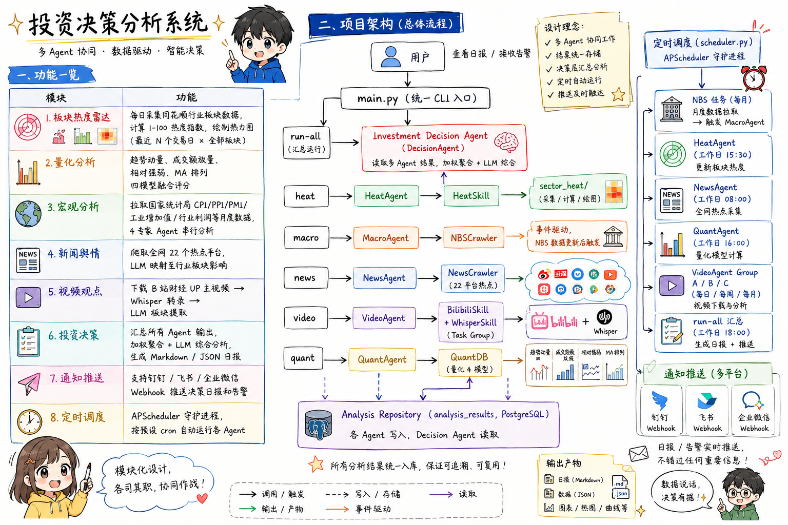

# DailySM -- Daily Sector Mind 行业板块 AI 研究平台 

> 面向 A 股行业板块的多 Agent 低频量化分析平台，融合热度雷达、量化模型、宏观数据、新闻舆情与视频观点，每日生成综合投资决策报告。

---

## 目录

- [功能概览](#功能概览)
- [项目架构](#项目架构)
- [目录结构](#目录结构)
- [安装部署](#安装部署)
- [配置说明](#配置说明)
- [使用教程](#使用教程)
- [定时调度](#定时调度)
- [通知推送](#通知推送)
- [数据说明](#数据说明)

---

## 功能概览

| 模块 | 功能 |
|---|---|
| **板块热度雷达** | 每日采集同花顺行业板块数据，计算 1-100 热度指数，绘制热力图（最近 N 个交易日 × 全部板块） |
| **量化分析** | 趋势动量、成交额放量、相对强弱、MA 排列四模型融合评分 |
| **宏观分析** | 拉取国家统计局 CPI/PPI/PMI/工业增加值/行业利润等月度数据，4 专家 Agent 串行分析 |
| **新闻舆情** | 爬取全网 22 个热点平台，LLM 映射至行业板块影响 |
| **视频观点** | 下载 B 站财经 UP 主视频 → Whisper 转录 → LLM 板块提取 |
| **投资决策** | 汇总所有 Agent 输出，加权聚合 + LLM 综合分析，生成 Markdown / JSON 日报 |
| **通知推送** | 支持钉钉 / 飞书 / 企业微信 Webhook 推送决策日报和告警 |
| **定时调度** | APScheduler 守护进程，按预设 cron 自动运行各 Agent |

---

## 项目架构

```
用户
  │
  ▼
main.py（统一 CLI 入口）
  │
  ├─ run-all ──→ Investment Decision Agent（DecisionAgent）
  │                     │  读取多 Agent 结果，加权聚合 + LLM 综合
  │                     ▼
  │              Analysis Repository（analysis_results，PostgreSQL）
  │                     ↑  各 Agent 写入，Decision Agent 读取
  │
  ├─ heat  ──→  HeatAgent  ──→  HeatSkill  ──→  sector_heat/（采集/计算/绘图）
  ├─ macro ──→  MacroAgent ──→  NBSCrawler（事件驱动，NBS数据更新后触发）
  ├─ news  ──→  NewsAgent  ──→  NewsCrawler（22平台热点）
  ├─ video ──→  VideoAgent ──→  BilibiliSkill + WhisperSkill（Task Group）
  │             QuantAgent ──→  QuantDB（量化4模型）
  │
  └─ schedule ──→ scheduler.py（APScheduler 守护进程）
                      │
                      ├─ NBS任务（月度拉取 → 触发 MacroAgent）
                      ├─ HeatAgent（工作日 15:30）
                      ├─ NewsAgent（工作日 08:00）
                      ├─ QuantAgent（工作日 16:00）
                      ├─ VideoAgent Group A/B/C（每日/每周/每月）
                      └─ run-all 汇总（工作日 18:00）
```

### Skill 层

```
skills/
├── llm_client.py      LLM 统一客户端（火山引擎 Ark / OpenAI 兼容）
├── heat_skill.py      板块热度封装
├── bilibili_skill.py  B站视频获取 + 音频下载
├── whisper_skill.py   Whisper 语音转文字
├── nbs_crawler.py     国家统计局数据爬虫
├── news_crawler.py    22平台新闻热点爬虫
├── quant_db.py        量化分析数据库
├── macro_db.py        宏观数据库（macro_nbs_data）
├── analysis_repo.py   分析结果仓库（analysis_results）
└── notification.py    通知中心（钉钉/飞书/企业微信）
```

### 数据库表（PostgreSQL）

| 表名 | 用途 |
|---|---|
| `sector_daily_raw` | 板块每日原始行情（涨跌幅、成交额、主力净流入等） |
| `sector_heat_index` | 板块热度指数（heat_score、continuous_score、sort_score） |
| `sector_quant_index` | 量化模型得分（趋势动量、放量、相对强弱、趋势评分） |
| `macro_nbs_data` | 国家统计局宏观指标（CPI/PPI/PMI/工业利润等，45+指标） |
| `analysis_results` | 各 Agent 分析结果仓库（支持缓存复用） |
|`market_index_daily` | 大盘数据 |
|`news_industry_mapping` | 消息面对板块影响的映射表 |
|`news_raw` | 记录新闻消息源，新闻内容概括等信息 |
---

## 目录结构

```
DailySM/
├── main.py                 # 统一 CLI 入口
├── scheduler.py            # APScheduler 调度守护进程
├── sector_heat_main.py     # 热度雷达独立 CLI（备用入口）
├── config.example.yaml     # 配置模板（复制后填入真实值）
├── requirements.txt        # Python 依赖
├── docker-compose.yml      # PostgreSQL 快速启动
│
├── agents/                 # Agent 层
│   ├── base.py             # AgentResult + BaseAgent 基类
│   ├── heat_agent.py       # 板块热度 Agent
│   ├── macro_agent.py      # 宏观分析 Agent（事件驱动）
│   ├── news_agent.py       # 新闻舆情 Agent
│   ├── video_agent.py      # 视频观点 Agent（Task Group）
│   ├── quant_agent.py      # 量化分析 Agent
│   └── decision_agent.py   # 投资决策 Agent（总编排）
│
├── skills/                 # Skill 层（可复用工具）
│   ├── llm_client.py
│   ├── heat_skill.py
│   ├── bilibili_skill.py
│   ├── whisper_skill.py
│   ├── nbs_crawler.py
│   ├── news_crawler.py
│   ├── quant_db.py
│   ├── macro_db.py
│   ├── analysis_repo.py
│   └── notification.py
│
├── sector_heat/            # 热度雷达核心模块
│   ├── collector.py        # 数据采集（同花顺 THS）
│   ├── calculator.py       # 热度指数计算（策略模式）
│   ├── engine.py           # 计算引擎（Capital / History Mode）
│   ├── db.py               # PostgreSQL CRUD
│   └── visualizer.py       # 热力图生成
│
├── pipeline/               # 视频流水线（B站 → 音频 → 转录 → 报告）
│
├── config/
|   ├── config.yaml         # 统一配置文件
│   └── schedules.yaml      # 调度任务配置（cron + 事件驱动）
│
└── data/                   # 运行时生成
    ├── audio/              # 下载的音频文件
    ├── transcripts/        # Whisper 转录结果
    ├── heatmaps/           # 热力图 PNG + JSON
    ├── reports/            # 分析报告（Markdown + JSON）
    └── cache/              # 日志、SQLite 状态库
```

---

## 安装部署

### 环境要求

- Python 3.10+
- PostgreSQL 14+（用于板块热度数据存储）
- ffmpeg（音频处理，B站视频下载依赖）
- 可选：NVIDIA GPU + CUDA 12（加速 Whisper 转录）

### 1. 克隆项目

```bash
git clone https://github.com/tungehy/DailySM.git
cd DailySM
```

### 2. 安装 Python 依赖

```bash
pip install -r requirements.txt
```

### 3. 安装 ffmpeg

```bash
# Windows（推荐使用 Scoop）
scoop install ffmpeg

# macOS
brew install ffmpeg

# Ubuntu / Debian
apt install ffmpeg
```

### 4. 启动 PostgreSQL

**方式 A：使用 Docker（推荐，一行启动）**

```bash
docker-compose up -d
```

**方式 B：使用已有的 PostgreSQL 实例**

创建数据库：

```sql
CREATE DATABASE dailysm;
```

### 5. 配置

```bash
cp config.example.yaml config.yaml
```

用编辑器打开 `config.yaml`，填写以下必填项：

| 配置项 | 说明 |
|---|---|
| `sector_heat.database.password` | PostgreSQL 密码 |
| `llm.api_key` | 火山引擎 Ark API Key（或 DeepSeek 等） |
| `llm.model` | 模型/接入点 ID |
| `bilibili.sessdata` | B 站 Cookie（如需视频功能） |

### 6. 初始化数据库并回填历史数据

```bash
# 初始化数据库表（首次运行自动建表）
# 回填板块热度历史数据（示例：2026年全年）
python sector_heat_main.py backfill --start 2026-01-01 --end 2026-07-08
```

---

### LLM 切换

默认使用火山引擎 Ark（豆包系列模型）。切换为 DeepSeek 或其他 OpenAI 兼容接口：

```yaml
llm:
  provider: "openai"
  openai:
    api_key: "sk-xxxx"
    base_url: "https://api.deepseek.com/v1"
    model: "deepseek-chat"
```

### 热度计算引擎模式

```yaml
sector_heat:
  heat_engine:
    mode: auto     # auto（自动检测） / capital（资金模式） / history（历史行情模式）
```

- **capital 模式**：使用主力净流入、涨停家数等实时资金数据（数据覆盖率高时自动启用）
- **history 模式**：仅使用历史成交额 + 涨跌幅，通过成交额相对强度和连续上涨天数评分

### 调度配置

编辑 `config/schedules.yaml` 可调整各任务的 cron 时间和有效期：

```yaml
agents:
  heat:
    schedule: "30 15 * * 1-5"   # 工作日 15:30
    expire_hours: 20              # 分析结果有效期
```

---

## 使用教程

### 每日全量分析（核心命令）

```bash
# 运行所有 Agent，生成综合决策日报
python main.py run-all

# 指定日期
python main.py run-all --date 2026-07-08

# 强制重新分析（忽略缓存）
python main.py run-all --force

# 只运行指定 Agent
python main.py run-all --agents heat,quant
```

### 板块热度雷达

```bash
# 采集今日数据 + 计算热度 + 绘制热力图
python main.py heat run

# 历史数据回填
python main.py heat backfill --start 2026-01-01 --end 2026-07-08

# 仅绘图（使用已有数据）
python main.py heat plot
```

### 宏观数据（事件驱动）

```bash
# 手动触发宏观分析（NBS 数据版本未变则自动复用缓存）
python main.py macro

# 强制重新分析
python main.py macro --force

# 跳过统计局爬虫（纯 LLM 分析）
python main.py macro --skip-nbs
```

### 新闻舆情分析

```bash
python main.py news
```

### 视频日报

```bash
# 视频流水线（下载 → 转录 → LLM 总结）默认今日
python main.py video

# 不下载，仅读取已有转录
python main.py video --date 2026-07-08
```

### 通知测试

```bash
# 向所有已配置渠道发送测试消息
python main.py notify-test
```

### 查看输出

- **热力图**：`data/heatmaps/heatmap_YYYY-MM-DD.png`
- **决策日报**：`data/reports/YYYY-MM-DD-decision.md`
- **JSON 数据**：`data/reports/YYYY-MM-DD-decision.json`
- **运行日志**：`data/cache/run.log`

---

## 定时调度

使用 APScheduler 守护进程实现全自动运行：

```bash
# 列出所有已配置的定时任务
python main.py schedule --list

# 启动调度守护进程（Ctrl+C 停止）
python main.py schedule
```

默认调度时间（可在 `config/schedules.yaml` 修改）：

| 任务 | 时间 | 说明 |
|---|---|---|
| HeatAgent | 工作日 15:30 | 收盘后采集计算 |
| NewsAgent | 工作日 08:00 | 开盘前舆情扫描 |
| QuantAgent | 工作日 16:00 | 收盘后量化评分 |
| VideoAgent（每日） | 工作日 17:00 | 当日博主观点 |
| VideoAgent（周度） | 每周日 19:00 | 周度复盘 |
| run-all 汇总 | 工作日 18:00 | 综合决策日报 |
| NBS CPI/PPI | 每月 9 日 10:00 | 通胀数据更新 |
| NBS PMI | 每月 1 日 09:00 | PMI 数据更新 |
| NBS 工业利润 | 每月 27 日 10:00 | 利润数据更新 → 触发 MacroAgent |

---

## 通知推送

编辑 `config.yaml` 中的 `notifications` 段启用推送：

```yaml
notifications:
  enabled: true
  channels:
    dingtalk:
      enabled: true
      webhook: "https://oapi.dingtalk.com/robot/send?access_token=xxx"
      secret: "SECxxx"    # 可选加签
```

支持渠道：钉钉、飞书、企业微信（均基于 Webhook，无需 SDK）。

---

## 数据说明

### 行情数据来源

- **同花顺（THS）**：通过 AkShare 调用，获取行业板块日 K 数据（涨跌幅、成交额等）
- 历史数据暂不包含主力净流入（THS 历史接口限制），系统自动切换为 **History Mode** 计算热度

### 宏观数据来源

- **国家统计局（NBS）**：通过官方 API 获取，含：
  - 规上工业增加值同比
  - 制造业 / 非制造业 / 综合 PMI
  - CPI（居民消费价格指数）
  - PPI（工业生产者出厂价格指数）
  - 45 个细分行业营业利润累计增长

### 注意事项

- 本项目仅供学习研究，不构成投资建议
- 所有分析结果基于公开数据，存在信息滞后和模型误差
- 使用前请确认符合数据来源平台的使用条款

---

## License

MIT
